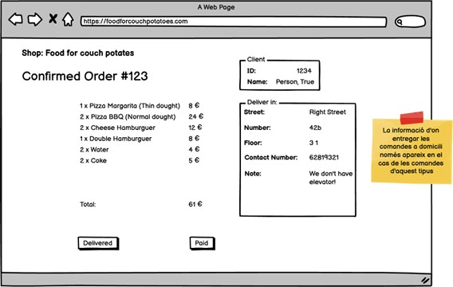
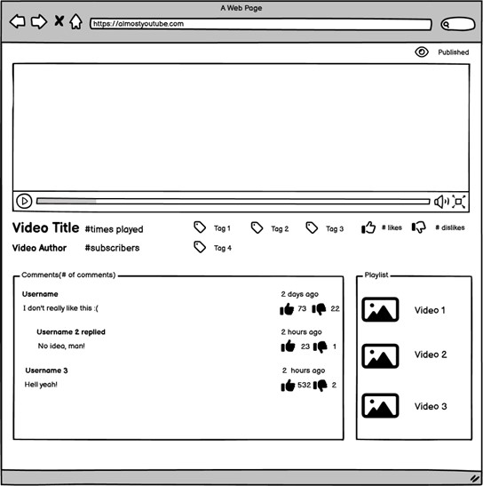

# Sprint 2 — Task 03: Data structure - MongoDB

## 📄 Description

This project focuses on the design and modeling of NoSQL databases using MongoDB. It includes data modeling based on different application perspectives and the representation of collections using diagrams and JSON/JS files.

The goal is to understand how to structure document-based databases from real-world requirements.

---

## 🎯 Objectives

- Learn how to model NoSQL databases  
- Design document-based data structures  
- Understand embedding vs referencing  
- Adapt models depending on application needs  
- Represent databases using diagrams and collections  

---

## 🛠 Technologies

- MongoDB  
- MongoDB Compass  
- Draw.io / Moon Modeler  
- JSON / JavaScript  
- Docker (optional)  

---

## 🧩 Database Design

### 🕶 Optical Store

This model represents an optical store system, including:

- Customers and personal data  
- Suppliers  
- Glasses and attributes  
- Sales and employees  
- Customer referrals  

---

#### Exercise 1 — Client Perspective

Interface reference:

Data model:

---

#### Exercise 2 — Glasses Perspective

Interface reference:

Data model:

---

### 🍕 Food Delivery

This model represents an online food ordering system, including:

- Customers  
- Orders  
- Products (pizzas, burgers, drinks)  
- Stores  
- Employees  
- Delivery management  

Interface reference:

Data model:

---

### 📺 YouTube (Simplified Model)

This model represents a simplified video platform, including:

- Users  
- Videos  
- Channels  
- Subscriptions  
- Likes / dislikes  
- Comments  
- Playlists  

Interface reference:

Data model:

---

## 🧱 Implementation

Each exercise includes:

- **Diagram** → Visual representation of the data model  
- **Collections** → JSON or JS files defining MongoDB structure  

The design focuses on:

- Embedding related data when useful  
- Avoiding unnecessary relations  
- Optimizing for query patterns  

---

## 🚀 How to Run

### Option 1 — Mongo Shell

mongosh  
use your_database  

---

### Option 2 — MongoDB Compass

- Create database  
- Create collections  
- Insert JSON documents  

---

## 📁 Project Structure

MongoDB-estructura/  
├── level-1/  
│   ├── exercise-1/  
│   │   ├── ui_client.png  
│   │   ├── diagram.jpg  
│   │   └── collections.json  
│   │  
│   └── exercise-2/  
│       ├── ui_glasses.png  
│       ├── diagram.jpg  
│       └── collections.json  
│  
├── level-2/  
│   └── exercise-1/  
│       ├── ui_food.png  
│       ├── diagram.jpg  
│       └── collections.json  
│  
├── level-3/  
│   └── exercise-1/  
│       ├── ui_youtube.png  
│       ├── diagram.jpg  
│       └── collections.json  
│  
├── README.md  
└── .gitignore  

---

## ⭐ Exercises

⭐ **Level 1**  
Optical store modeling from different perspectives  

⭐⭐ **Level 2**  
Food delivery system  

⭐⭐⭐ **Level 3**  
YouTube system  

---

## ✅ Progress

### Level 1

- [x] 1. Optical Store — Client perspective  
- [x] 2. Optical Store — Glasses perspective  

### Level 2

- [] 1. Food delivery system  

### Level 3

- [] 1. YouTube model  

---

## 🔍 Notes

- MongoDB models depend on how data is used  
- Same system can have different valid designs  
- UI helps define access patterns  
- Diagrams improve understanding but do not enforce schema  
- The database was tested using Docker as a local MongoDB environment  
- Docker is optional, collections can be created manually or imported using scripts or MongoDB Compass  